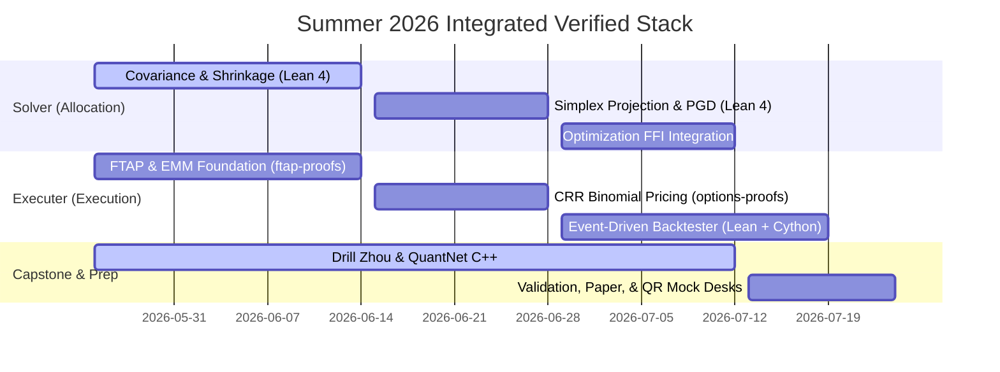

# Strategic Vision: Verified Portfolio Optimization & Execution Stack

This document outlines the revised architecture and roadmap for your summer project. We address two critical clarifications:
1.  **Execution Engine Scope**: The legacy options engine is archived. We will implement both the **execution kernel** (`backtest-proofs/`) and the **optimizer core** (`portfolio-proofs/`) simultaneously from scratch, creating a clean, integrated, and modern systematic stack.
2.  **Solver Scale vs. Gurobi**: We are **not** implementing a massive, general-purpose commercial solver like Gurobi in Lean 4. Instead, we are building a **specialized, high-performance, compiler-verified Convex Quadratic Programming (QP) solver** using **Projected Gradient Descent (PGD) with Simplex Projection**.

---

## 1. Projected Gradient Descent: The Achievable Solver

Implementing Gurobi in Lean 4 is a multi-decade compiler project. However, portfolio optimization is a highly structured convex problem:
$$\min_w \frac{1}{2} w^T \Sigma w - \mu^T w \quad \text{subject to} \quad \sum w_i = 1, \quad w_i \ge 0$$

For this specific problem, we implement **Projected Gradient Descent (PGD) with Simplex Projection**:

```
        ┌──────────────────────────────────────────────────┐
        │  1. Gradient Step                                │
        │  w_half = w_k - η (Σ w_k - μ)                     │
        └────────────────────────┬─────────────────────────┘
                                 │
                                 ▼
        ┌──────────────────────────────────────────────────┐
        │  2. Simplex Projection                           │
        │  w_{k+1} = Π_Δ (w_half)                          │
        │  - Classic O(N log N) sorting-based projection   │
        └────────────────────────┬─────────────────────────┘
                                 │
                                 ▼
        ┌──────────────────────────────────────────────────┐
        │  Proven Invariants:                              │
        │  - w_{k+1} is strictly on the Simplex            │
        │  - Objective function strictly decreases         │
        └──────────────────────────────────────────────────┘
```

### Why this is mathematically beautiful and highly achievable:
*   **Simplex Projection ($\Pi_{\Delta}$)** has a classic, explicit $O(N \log N)$ algorithm:
    1.  Sort the input vector $y$ in descending order to get $u$.
    2.  Find $K = \max \{ j \in [1, N] \mid u_j + \frac{1}{j} (1 - \sum_{i=1}^j u_i) > 0 \}$.
    3.  Compute threshold $\tau = \frac{1}{K} (1 - \sum_{i=1}^K u_i)$.
    4.  Set $x_i = \max(y_i + \tau, 0)$.
*   **Formalization Scope**: In Lean 4, we prove that $\Pi_{\Delta}(y)$ strictly minimizes the Euclidean distance to $y$ subject to $\sum x_i = 1$ and $x_i \ge 0$. We then prove the convergence of the gradient steps under the positive semi-definite covariance matrix $\Sigma$.
*   This requires only a few hundred lines of elegant Lean 4 code, while still representing an academic-grade mathematical accomplishment.

---

## 2. Simultaneous Implementation: The Integrated Stack

Since the legacy `archive/` code is superseded, we will build a clean, unified codebase across two modules this summer:

1.  **`portfolio-proofs/` (The Allocator)**:
    *   Estimates the Ledoit-Wolf shrinkage covariance matrix $\Sigma$ (proven positive semi-definite).
    *   Solves the target weights $w_i$ using the verified PGD solver.
2.  **`backtest-proofs/` (The Executer)**:
    *   A clean, event-driven delta-hedging options backtesting engine in Python/Cython.
    *   Exposes a verified Lean 4 accounting kernel to ensure cash conservation and exact option settlement.

---

## 📅 Summer 2026 Revised Timeline (May 25 – July 24)

This schedule coordinates the concurrent development of the **Optimizer** and **Execution Kernel**, alongside intensive **QR Interview Prep**.



### Detailed Breakdown

*   **Weeks 1–3 (May 25 – Jun 14) — Mathematical Foundations**
    *   *Optimizer*: Define the covariance shrinkage module in Lean 4; prove positive semi-definiteness (`shrinkage_psd`).
    *   *Executer*: Complete the `ftap-proofs` mathematical spine (proving EMM and no-arbitrage equivalence).
    *   *QR Prep*: **Zhou's Green Book Ch. 4** (Linear algebra, eigenvalues, PDF/CDF probability).
*   **Weeks 4–5 (Jun 15 – Jun 28) — Algorithmic Solvers & Pricing**
    *   *Optimizer*: Implement Projected Gradient Descent and the $O(N \log N)$ Simplex Projection in Lean 4; prove box-constraint convergence.
    *   *Executer*: Complete the CRR pricing model and put-call parity proofs in `options-proofs/` (citing the EMM results).
    *   *QR Prep*: **QuantNet C++ Ch. 4–6** (Binomial pricing structures, OOP design) + **Zhou Ch. 5** (Stochastic processes).
*   **Weeks 6–7 (Jun 29 – Jul 12) — FFI & System Integration**
    *   *Optimizer*: Compile the Lean solver to C; write Cython FFI bindings; build the Python optimizer wrapper.
    *   *Executer*: Build the clean event-driven backtester in `backtest-proofs/` (Python/Cython event-loop bound to a verified Lean 4 accounting kernel).
    *   *QR Prep*: **Zhou Ch. 6** (Black-Scholes theory, Greeks pricing, delta-hedging metrics).
*   **Weeks 8–9 (Jul 13 – Jul 24) — Validation, Capstone Paper, & Mock Interviews**
    *   *System*: Run the full end-to-end verified pipeline (Optimizer outputs target weights $\rightarrow$ Backtester executes and logs marks). Validate against CVXPY and scipy.
    *   *Output*: Draft the SSRN preprint: *"Formally Verified Convex Portfolio Optimization: Eliminating Numerical Instability and Constraint Violations in Systematic Asset Allocation."*
    *   *Recruiting*: Drill mock quant interviews, mental math, and resume pitch delivery.
