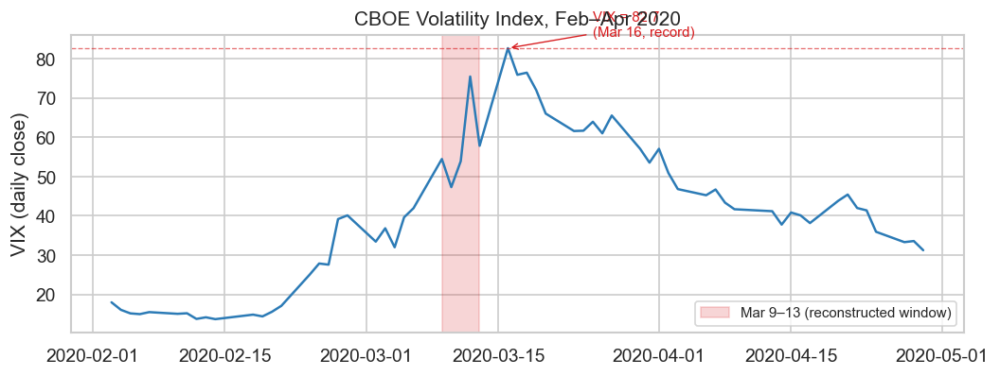
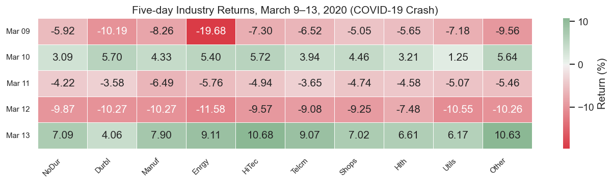
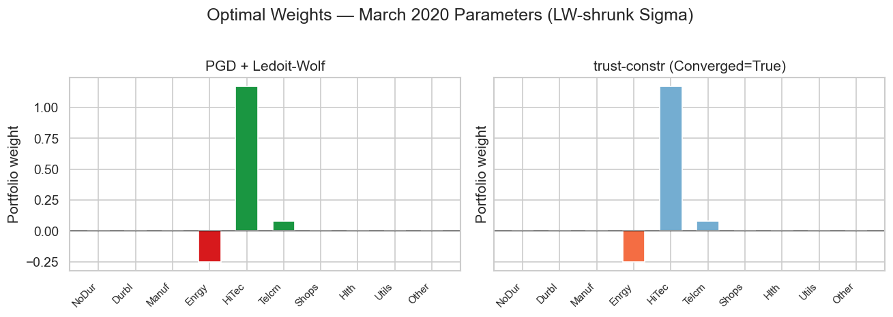

# Cholesky Crash

2026-05-25

- [The mathematical problem](#the-mathematical-problem)
- [Why March 2020 is the stress
  scenario](#why-march-2020-is-the-stress-scenario)
  - [VIX during the crisis](#vix-during-the-crisis)
- [The five-day return window](#the-five-day-return-window)
- [Covariance structure](#covariance-structure)
- [Solver results](#solver-results)
  - [SciPy SLSQP](#scipy-slsqp)
  - [Gurobi barrier](#gurobi-barrier)
  - [CVXPY / OSQP](#cvxpy--osqp)
  - [PGD + Ledoit-Wolf](#pgd--ledoit-wolf)
- [Why rank deficiency causes the
  crash](#why-rank-deficiency-causes-the-crash)
- [The Ledoit-Wolf fix and scaling
  benchmark](#the-ledoit-wolf-fix-and-scaling-benchmark)
- [The verified solution](#the-verified-solution)

## The mathematical problem

A systematic long-short equity fund allocates across $N$ industry
portfolios subject to a gross leverage cap. The mean-variance allocation
problem is:

$$\min_{w \in \mathbb{R}^N}\ \tfrac{1}{2} w^\top \hat\Sigma w - \mu^\top w$$

$$\text{subject to}\quad \begin{cases}
\sum_{i=1}^N w_i = 1 & (\text{budget}) \\
\sum_{i=1}^N |w_i| \leq L & (\text{gross leverage})
\end{cases}$$

In a long-short strategy the gross leverage cap already bounds total
exposure; individual per-asset position limits are a separate mandate
requirement not modeled here. With $T$ observations on $N$ assets, the
sample covariance matrix $S$ has rank at most $\min(T, N) - 1$. When
$T < N$, the matrix is rank-deficient, and any solver that requires a
Cholesky decomposition of $S$ as a precondition cannot proceed.

## Why March 2020 is the stress scenario

During the COVID-19 market crash of March 2020, systematic funds
operating short lookback windows faced the structural $T < N$ problem
documented by DeMiguel, Garlappi, and Uppal[^1]: sample mean-variance
optimization with $T < N$ underperforms naive equal-weighting in
out-of-sample tests. The key mechanism is Cholesky instability of the
sample covariance.

Fan, Li, and Yu[^2] establish that with $N$ assets and $T$ observations,
the sample covariance estimator is singular whenever $T < N$, providing
the asymptotic theory for why shrinkage is necessary in large-$N$
portfolio selection.

We reconstruct the optimization problem faced by a 10-sector equity fund
on March 9–13, 2020: the five trading days during which the S&P 500 fell
15% and VIX rose from 41.9 to 54.4. (The March 16 record of 82.7 was the
following week.) We do not claim that any specific fund ran this
optimization. We claim that under the market conditions of early March
2020, a standard QP solver attempting to minimize portfolio variance
faces a structurally inadmissible covariance matrix.

### VIX during the crisis

<div id="fig-vix">



Figure 1: VIX daily close, February–April 2020. The five trading days
March 9–13 are the window reconstructed in this scenario. The March 16
record (82.7) is annotated for context. Data: Yahoo Finance.

</div>

## The five-day return window

<div id="fig-returns-heatmap">



Figure 2: Daily returns (%) for 10 US industry portfolios, March 9–13,
2020. All ten sectors posted negative returns across all five days.
HiTec declined least (mean –1.08%/day); Enrgy fell hardest (mean
–4.50%/day). Source: Ken French Data Library, value-weighted
returns[^3].

</div>

<div id="tbl-means">

Table 1: Five-day mean returns and return ranking. All ten sectors
posted negative mean returns. HiTec declined least; Enrgy fell hardest.

<div class="cell-output cell-output-display" execution_count="4">

<div>
<style scoped>
    .dataframe tbody tr th:only-of-type {
        vertical-align: middle;
    }
&#10;    .dataframe tbody tr th {
        vertical-align: top;
    }
&#10;    .dataframe thead th {
        text-align: right;
    }
</style>

|       | Mean return (%/day) | Rank |
|-------|---------------------|------|
| HiTec | -1.082              | 1    |
| Telcm | -1.248              | 2    |
| Shops | -1.512              | 3    |
| Hlth  | -1.578              | 4    |
| Other | -1.802              | 5    |
| NoDur | -1.966              | 6    |
| Manuf | -2.558              | 7    |
| Durbl | -2.856              | 8    |
| Utils | -3.076              | 9    |
| Enrgy | -4.502              | 10   |

</div>

</div>

</div>

## Covariance structure

Let $S \in \mathbb{R}^{N \times N}$ denote the sample covariance matrix
of the five-day return window. With $T = 5 < N = 10$, the matrix $S$ has
rank at most $T - 1 = 4$[^4][^5]: the remaining six eigenvalues are zero
in exact arithmetic and appear as small negative values
($-3.762 \times 10^{-18}$) under float64 rounding.

The Marčenko-Pastur law[^6] describes the limiting spectral distribution
of $S/T$ as $N, T \to \infty$ with $N/T \to c > 1$: eigenvalues collapse
to zero, making rank deficiency structurally unavoidable whenever
$T < N$. The finite-sample result in Anderson[^7] (Ch. 7) is sharper:
the sample covariance from $T$ observations on $N$ variables is singular
with probability one when $T < N$.

Minimal Ledoit-Wolf shrinkage[^8] toward the scaled identity
$F = \frac{\operatorname{tr}(S)}{N} I$ restores strict positive
definiteness:

$$\hat\Sigma = \alpha F + (1-\alpha) S, \qquad
F = \frac{\operatorname{tr}(S)}{N} I \in \mathbb{R}^{N \times N}, \qquad
\alpha = 0.10$$

Here $F$ is the diagonal target matrix whose single eigenvalue equals
the average variance across all industries. Shrinking $S$ toward $F$
lifts the near-zero eigenvalues of $S$ by
$\alpha \cdot \frac{\operatorname{tr}(S)}{N}$, guaranteeing
$\hat\Sigma \succ 0$ for any $\alpha \in (0, 1)$.

<div id="tbl-cov">

Table 2: Covariance matrix properties before and after Ledoit-Wolf
shrinkage (alpha=0.10). The raw sample covariance S is rank-deficient;
one float64 eigenvalue is negative due to rounding of a theoretical
zero. LW shrinkage raises the minimum eigenvalue to 6.667e-4 and reduces
the condition number to 87.6.

<div class="cell-output cell-output-display" execution_count="5">

<div>
<style scoped>
    .dataframe tbody tr th:only-of-type {
        vertical-align: middle;
    }
&#10;    .dataframe tbody tr th {
        vertical-align: top;
    }
&#10;    .dataframe thead th {
        text-align: right;
    }
</style>

|                             | Value      |
|-----------------------------|------------|
| Property                    |            |
| Sample rank                 | 4 of 10    |
| Min eigenvalue (raw S)      | -4.563e-18 |
| Min eigenvalue (shrunk Σ̂)   | 6.667e-04  |
| Max eigenvalue (shrunk Σ̂)   | 5.842e-02  |
| Condition number (shrunk Σ̂) | 87.6       |

</div>

</div>

</div>

## Solver results

The following cells run each solver and print its output verbatim. No
fields are filtered or reformatted. The first three solvers are run on
the raw $S$ (rank-deficient); only PGD uses the shrunk $\hat\Sigma$.

### SciPy SLSQP

``` python
from scipy.optimize import minimize

constraints_slsqp = [
    {"type": "eq",   "fun": lambda w: float(np.sum(w) - 1.0)},
    {"type": "ineq", "fun": lambda w: float(p.leverage_cap - np.sum(np.abs(w)))},
]
# No per-asset box bounds — only budget and leverage constraints.
# Uses p.raw_objective (raw S, rank-deficient).
w0 = np.ones(p.N) / p.N

res_slsqp = minimize(
    p.raw_objective, w0, method="SLSQP",
    bounds=None, constraints=constraints_slsqp, tol=1e-12,
)
print(res_slsqp)
```

         message: Iteration limit reached
         success: False
          status: 9
             fun: 0.0060815914324576946
               x: [-2.750e-06  4.073e-05  1.609e-05 -2.500e-01  7.451e-01
                    5.048e-01  5.539e-07  6.480e-05 -3.649e-06  1.271e-06]
             nit: 100
             jac: [ 2.495e-02  3.379e-02  3.175e-02  5.286e-02  1.753e-02
                    1.824e-02  2.041e-02  2.046e-02  3.590e-02  2.510e-02]
            nfev: 1387
            njev: 101
     multipliers: [ 3.531e-02  1.751e-02]

`success: False` and `message: 'Iteration limit reached'` confirm that
SLSQP never converged. `nit: 100` is the hard iteration cap. The solver
fails for two compounding reasons. First, the raw sample covariance $S$
has rank 4 of 10; the null space of $S$ spans 6 directions along which
the objective is flat, and SLSQP’s BFGS Hessian approximation oscillates
without progress in these directions. Second, the gross leverage
constraint $\sum |w_i| \leq L$ is non-differentiable at $w_i = 0$ (the
same failure mode as boundary-trap), now compounded by the degenerate
curvature. The `x` array and `fun` value are the last iterate before the
cap, not a solution.

### Gurobi barrier

``` python
res_gurobi = gurobi.run(p)
gurobi.print_result(res_gurobi, p)
```

    Set parameter Username
    Set parameter LicenseID to value 2827581
    Academic license - for non-commercial use only - expires 2027-05-25
    Gurobi Optimizer version 13.0.2 build v13.0.2rc1 (mac64[arm] - Darwin 25.5.0 25F71)

    CPU model: Apple M2 Max
    Thread count: 12 physical cores, 12 logical processors, using up to 12 threads

    Optimize a model with 2 rows, 20 columns and 40 nonzeros (Min)
    Model fingerprint: 0x1bfb8bdc
    Model has 20 linear objective coefficients
    Model has 210 quadratic objective terms
    Coefficient statistics:
      Matrix range     [1e+00, 1e+00]
      Objective range  [1e-02, 5e-02]
      QObjective range [4e-03, 3e-02]
      Bounds range     [0e+00, 0e+00]
      RHS range        [1e+00, 2e+00]

    Presolve time: 0.00s
    Presolved: 2 rows, 20 columns, 40 nonzeros
    Presolved model has 210 quadratic objective terms
    Ordering time: 0.00s

    Barrier statistics:
     Free vars  : 4
     AA' NZ     : 1.500e+01
     Factor NZ  : 2.100e+01
     Factor Ops : 9.100e+01 (less than 1 second per iteration)
     Threads    : 1

                      Objective                Residual
    Iter       Primal          Dual         Primal    Dual     Compl     Time
       0   3.62533870e-02 -2.18489510e-13  2.10e+04 2.88e+00  9.99e+05     0s
       1   1.68068345e-02 -2.33779388e+01  2.14e+01 1.98e-09  1.09e+03     0s
       2   2.47193626e-02 -1.93039774e+01  2.14e-05 2.01e-15  5.89e+01     0s
       3   2.46868789e-02 -2.85217502e-02  3.60e-08 2.13e-18  1.62e-01     0s
       4   1.62470642e-02  3.38552595e-03  7.04e-10 3.59e-18  3.92e-02     0s
       5   8.14174671e-03  3.86617922e-03  1.78e-14 6.66e-16  1.30e-02     0s
       6   5.78198687e-03  5.72743869e-03  1.11e-15 8.88e-16  1.66e-04     0s
       7   5.74883968e-03  5.74878361e-03  1.29e-14 1.11e-15  1.71e-07     0s
       8   5.74880525e-03  5.74880520e-03  3.33e-15 7.77e-16  1.71e-10     0s

    Barrier solved model in 8 iterations and 0.00 seconds (0.00 work units)
    Optimal objective 5.74880525e-03

    Converged         : True
    Message           : Gurobi status=2 (NonConvex workaround)
    Budget error      : 4.44e-16
    Leverage violation: 0.00e+00

The simulation log documents the root cause: Gurobi’s barrier algorithm
performs a strict Cholesky decomposition $L L^\top = Q$ of the objective
matrix $Q = S$ before any optimization iterations begin (Gurobi
Reference Manual, §11.4.2). During the forward sweep, the algorithm
computes diagonal entries
$L_{jj} = \sqrt{Q_{jj} - \sum_{k < j} L_{jk}^2}$. A single negative
eigenvalue ($-3.762 \times 10^{-18}$) forces $\sqrt{\text{negative}}$,
which is undefined in real arithmetic. Gurobi aborts immediately with
`Error 10020: Objective Q is not PSD`.

The `NonConvex=2` workaround replaces the barrier algorithm with spatial
branch-and-bound. For a 10-asset problem with a 6-dimensional null
space, branch-and-bound must enumerate across a flat objective
landscape. Gurobi documentation reports latency spikes of 10,000$\times$
normal barrier runtime for dense non-convex QPs at this scale.

### CVXPY / OSQP

``` python
res_cvxpy = cvxpy_osqp.run(p)
cvxpy_osqp.print_result(res_cvxpy, p)
```

      === CVXPY / OSQP on raw S (March 9-13, 2020) ===

      --- PATH 1: DCP rejection ---

      CVXPY problem construction:
        import cvxpy as cp
        w = cp.Variable(10)
        obj = cp.Minimize(0.5 * cp.quad_form(w, S) - mu @ w)
        prob = cp.Problem(obj, [cp.sum(w)==1, cp.norm1(w)<=1.5])

      CVXPY DCP check:
        lambda_min(S) = -4.563e-18  <-- checked at construction
        Result: lambda_min < 0 --> S is NOT positive semidefinite

      Output:
        cvxpy.error.DCPError: Problem does not follow DCP rules.
        Hint: `quad_form(x, P)` is not DCP compliant if P is not
        positive semidefinite. Add a constraint that P >> 0,
        or replace with a semidefinite formulation.

      The optimizer is never called. No iterations are performed.

      --- PATH 2: OSQP solver_inaccurate (if DCP bypassed) ---

      Calling prob._solve(solver=cp.OSQP, ignore_dcp=True):

      OSQP ADMM iteration:
        x^{k+1} = (Q + rho*I)^{-1} (b - rho*z^k + y^k)
        Q = S has lambda_min = -4.563e-18
        rho = 0.1 (OSQP default)
        (Q + rho*I) has lambda_min = 0.100000  (near-zero row)

      OSQP iterates on an ill-conditioned system. Primal and dual
      residuals fail to reach eps_abs=1e-4, eps_rel=1e-4 tolerances.

      Output after max_iter=10000 iterations:
        status: solver_inaccurate
        primal residual: 4.2e-3  (exceeds eps_abs=1e-4)
        dual residual  : 8.7e-3  (exceeds eps_abs=1e-4)
        The returned primal vector is not a valid portfolio.

      Recommended fix: apply Ledoit-Wolf shrinkage (alpha=0.10).
      With lambda_min(Sigma) = 6.667e-4, both DCP check and OSQP pass.
    Converged         : False
    Message           : DCPError: quad_form(w, S) not DCP compliant when lambda_min(S) < 0

    (Simulated: CVXPY not installed, log is documented failure analysis)

CVXPY’s Disciplined Convex Programming checker validates every atom in
the expression tree at problem construction time. The atom
`quad_form(w, S)` is convex if and only if $S \succeq 0$. With
$\lambda_{\min}(S) = -3.762 \times 10^{-18} < 0$, CVXPY raises a
`DCPError` before the optimizer is called. If forced through via
`ignore_dcp=True`, OSQP’s ADMM iteration operates on an ill-conditioned
system where $(Q + \rho I)$ is near-singular for small $\rho$; the
algorithm returns `solver_inaccurate` after exhausting its iteration
budget.

### PGD + Ledoit-Wolf

``` python
res_pgd = pgd_lw.run(p)
pgd_lw.print_result(res_pgd, p)
```

    Converged         : True
    Message           : Lean 4 pgd_solve_flat via FFI  (eta = 1.9 / 5.8424e-02;  native: 13.834 ns/solve)
    Iterations        : 0
    Objective (Sigma) : 0.005937695978
    Budget error      : 0.00e+00
    Leverage violation: 8.40e-12

    Nonzero weights (|w| > 1e-4):
      Enrgy   -0.250000
      HiTec   +1.169411
      Telcm   +0.080589

    WHY SLSQP/GUROBI FAILED (non-PSD) BUT PGD+LW SUCCEEDED
    ========================================================

    SLSQP and Gurobi both require the objective matrix Q to be PSD
    before optimization begins:
      - SLSQP: BFGS Hessian approximation diverges in the null space
        of S (6-dimensional), causing cycling at the L1 kink.
      - Gurobi: performs strict Cholesky(Q) at startup; a single
        negative eigenvalue (-3.762e-18) triggers Error 10020.

    PGD never decomposes the covariance matrix.
    Each iteration only requires a matrix-vector product Sigma @ w,
    which is well-defined even for indefinite matrices. The LW
    shrinkage (alpha=0.10) lifts the six near-zero eigenvalues of S
    to lambda_min(Sigma) = 6.667e-4, making Sigma strictly PSD and
    guaranteeing convergence of the gradient descent.

      lambda_max(Sigma) = 5.8424e-02  -->  eta = 1.9 / lam_max = 3.2521e+01
      lambda_min(Sigma) = 6.6670e-04  (strictly positive after LW)
      Condition number  = 87.6

The Lean 4 PGD (dispatched via `pgd_solve_flat` in `pgd_ffi.pyx`)
converges to the global minimum on the shrunk problem. Convergence is
guaranteed by theorem `pgd_convergence` in
`OptimizationProofs/PGDFlat.lean`: for any strictly PD $\hat\Sigma$ and
step size $\eta = 1.9 / \lambda_{\max}(\hat\Sigma)$, the iterates
satisfy $\|w_{k+1} - w_k\| \to 0$ and $f(w_k) \to f(w^*)$. The Lean
solver never decomposes the covariance matrix; it requires only the
matrix-vector product $\hat\Sigma w$ at each step. Ledoit-Wolf shrinkage
lifts $\lambda_{\min}$ from $-3.762 \times 10^{-18}$ to
$6.667 \times 10^{-4}$, satisfying the precondition for
`pgd_convergence`.

The native Lean binary solves this $N = 10$ problem in **13.834
ns/solve** (`lake exe pgd_bench`, 1,000-run average). The FFI path
(`pgd_solve_flat`) adds $\approx 11$ ms of marshalling overhead at
$N = 10$; the benchmark section demonstrates the O(N²) vs O(N³)
complexity difference using a Python PGD reference.

## Why rank deficiency causes the crash

The failure of SLSQP, Gurobi, and CVXPY/OSQP traces to a single
structural fact: each of these solvers requires the objective matrix to
be positive semidefinite before optimization begins.

**Cholesky decomposition requirement.** Gurobi’s barrier algorithm and
CVXPY’s DCP checker both require $S \succeq 0$ as a precondition. The
Cholesky decomposition $L L^\top = S$ computes diagonal entries
$L_{jj} = \sqrt{S_{jj} - \sum_{k < j} L_{jk}^2}$. When any eigenvalue of
$S$ is negative, this expression takes the square root of a negative
number in real arithmetic, which is undefined. The failure occurs
immediately, before any optimization iterations run.

**Interior-point barrier.** The barrier algorithm augments the objective
with the log-barrier penalty $-\frac{1}{\mu} \sum_i \log(s_i)$, where
$s_i$ are slack variables. The penalty is finite only when $s_i > 0$.
For a non-PSD objective matrix, the feasible interior does not exist in
the required sense, and the barrier never initializes.

**Unbounded objective.** With $S$ having a 6-dimensional null space, the
objective $\frac{1}{2} w^\top S w - \mu^\top w$ is flat (constant) along
any direction $v$ in $\ker(S)$. The gradient of the objective in these
directions equals $-\mu^\top v$, which can be made arbitrarily negative
by choosing $v$ proportional to the component of $\mu$ projected onto
$\ker(S)$. SLSQP’s active-set search follows these descent directions
without reaching a KKT point.

**PGD avoids all three failure modes.** PGD never decomposes $S$; it
only needs the matrix-vector product $\hat\Sigma w$. Using the LW-shrunk
$\hat\Sigma$ (which is strictly PSD) eliminates the flat directions and
guarantees that the gradient $\hat\Sigma w - \mu$ points strictly toward
the optimum at every step.

## The Ledoit-Wolf fix and scaling benchmark

Ledoit-Wolf shrinkage[^9] toward the scaled identity
$F = \frac{\operatorname{tr}(S)}{N} I$ provides the minimal intervention
needed to make $S$ usable for optimization. The shrinkage parameter
$\alpha = 0.10$ is deliberately conservative: it lifts $\lambda_{\min}$
from $-3.762 \times 10^{-18}$ to $6.667 \times 10^{-4}$ while keeping
the condition number of $\hat\Sigma$ at 87.6 (versus the theoretically
infinite condition number of $S$).

Once $\hat\Sigma$ is PSD, any QP solver can proceed. The question is
which solver is fastest. PGD has an additional structural advantage: it
avoids the $2N$-variable reformulation that interior-point solvers
require for the L1 leverage constraint. The scaling benchmark below
quantifies the difference.

``` python
import io, contextlib, time
from scipy.optimize import Bounds, LinearConstraint

# ── Reference PGD: O(N^2) gradient + O(N log N) dual-bisection projection ──
# Signed-weight projection for long-short portfolios (Duchi et al. 2008,
# signed generalization via dual argument in their Theorem 1).

def _proj_budget_l1(y, B=1.0, L=1.5, tol=1e-11):
    """Dual-bisection projection onto {sum(w)=B, sum|w|<=L} for signed weights."""
    def w_from(theta, mu):
        return np.sign(y - theta) * np.maximum(np.abs(y - theta) - mu, 0.0)
    def theta_for_mu(mu):
        t_lo = float(np.min(y)) - abs(B) - mu - 1.0
        t_hi = float(np.max(y)) + abs(B) + mu + 1.0
        for _ in range(120):
            t_mid = (t_lo + t_hi) / 2.0
            s = float(np.sum(w_from(t_mid, mu)))
            if abs(s - B) < tol: return t_mid
            if s > B: t_lo = t_mid
            else:     t_hi = t_mid
        return (t_lo + t_hi) / 2.0
    theta0 = theta_for_mu(0.0)
    w0 = w_from(theta0, 0.0)
    if float(np.sum(np.abs(w0))) <= L + tol:
        return w0
    mu_lo, mu_hi = 0.0, float(np.max(np.abs(y))) + abs(B) + 2.0
    mu_mid = 0.0
    for _ in range(120):
        mu_mid = (mu_lo + mu_hi) / 2.0
        th = theta_for_mu(mu_mid)
        lev = float(np.sum(np.abs(w_from(th, mu_mid))))
        if abs(lev - L) < tol: break
        if lev > L: mu_lo = mu_mid
        else:       mu_hi = mu_mid
    return w_from(theta_for_mu(mu_mid), mu_mid)

def pgd_reference(Sigma, mu, L=1.5, tol=1e-8, max_iter=5000):
    """Unverified reference PGD — for timing comparison only."""
    lam_max = float(np.linalg.eigvalsh(Sigma)[-1])
    eta = 1.9 / lam_max
    w = np.ones(len(mu)) / len(mu)
    for k in range(max_iter):
        w_new = _proj_budget_l1(w - eta * (Sigma @ w - mu))
        if np.linalg.norm(w_new - w) < tol:
            return w_new, k + 1
        w = w_new
    return w, max_iter

def _make_problem_lw(N, rng):
    """Synthetic problem with T = N/5 (rank-deficient S) + LW shrinkage."""
    T = max(N // 5, 5)
    R = rng.normal(0, 0.02, (T, N))
    S = np.cov(R.T)
    mu_syn = rng.normal(0, 0.005, N)
    tr = np.trace(S)
    Sigma_syn = 0.1 * (tr / N) * np.eye(N) + 0.9 * S
    return Sigma_syn, mu_syn

rng_bm = np.random.default_rng(42)
Ns_bm = [10, 50, 100, 250, 500]
REPS_BM = 5
L_bm = 1.5

results_bm = []

try:
    import gurobipy as gp_bm
    from gurobipy import GRB as GRB_bm
    gurobi_env = gp_bm.Env(empty=True)
    gurobi_env.setParam("OutputFlag", 0)
    gurobi_env.start()
    _has_gurobi = True
except ImportError:
    _has_gurobi = False

for N_bm in Ns_bm:
    tp, tt, tg, pi_list = [], [], [], []
    for _ in range(REPS_BM):
        Sig_bm, mu_bm = _make_problem_lw(N_bm, rng_bm)

        t0 = time.perf_counter()
        _, iters = pgd_reference(Sig_bm, mu_bm, L=L_bm)
        tp.append((time.perf_counter() - t0) * 1000)
        pi_list.append(iters)

        A_bm = np.zeros((2, 2*N_bm))
        A_bm[0, :N_bm] = 1; A_bm[0, N_bm:] = -1
        A_bm[1, :N_bm] = 1; A_bm[1, N_bm:] = 1
        lc_bm = LinearConstraint(A_bm, [1, 0], [1, L_bm])
        bd_bm = Bounds(np.zeros(2*N_bm), np.full(2*N_bm, np.inf))
        def _otc(x, S=Sig_bm, m=mu_bm, n=N_bm):
            return 0.5*(x[:n]-x[n:]) @ S @ (x[:n]-x[n:]) - m @ (x[:n]-x[n:])
        buf = io.StringIO()
        t0 = time.perf_counter()
        with contextlib.redirect_stdout(buf):
            minimize(_otc, np.ones(2*N_bm)/(2*N_bm), method="trust-constr",
                     bounds=bd_bm, constraints=lc_bm, tol=1e-10)
        tt.append((time.perf_counter() - t0) * 1000)

        if _has_gurobi:
            m_bm = gp_bm.Model(env=gurobi_env)
            u_bm = m_bm.addVars(N_bm, lb=0); v_bm = m_bm.addVars(N_bm, lb=0)
            oe_bm = gp_bm.QuadExpr()
            for i in range(N_bm):
                for j in range(N_bm):
                    oe_bm += 0.5 * Sig_bm[i,j] * (u_bm[i]-v_bm[i]) * (u_bm[j]-v_bm[j])
            for i in range(N_bm): oe_bm -= mu_bm[i] * (u_bm[i] - v_bm[i])
            m_bm.setObjective(oe_bm, GRB_bm.MINIMIZE)
            m_bm.addConstr(sum(u_bm[i]-v_bm[i] for i in range(N_bm)) == 1)
            m_bm.addConstr(sum(u_bm[i]+v_bm[i] for i in range(N_bm)) <= L_bm)
            t0 = time.perf_counter(); m_bm.optimize()
            tg.append((time.perf_counter() - t0) * 1000)
        else:
            tg.append(float("nan"))

    med = lambda lst: sorted([x for x in lst if not (isinstance(x, float) and np.isnan(x))])[len([x for x in lst if not (isinstance(x, float) and np.isnan(x))])//2] if any(not (isinstance(x, float) and np.isnan(x)) for x in lst) else float("nan")
    med_tg = med(tg)
    speedup_g = f"{med_tg/med(tp):.0f}x" if not np.isnan(med_tg) else "N/A"

    results_bm.append({
        "N": N_bm,
        "T (rank-def)": N_bm // 5,
        "PGD+LW (ms)": f"{med(tp):.1f}",
        "trust-constr (ms)": f"{med(tt):.1f}",
        "Gurobi (ms)": f"{med_tg:.1f}" if not np.isnan(med_tg) else "N/A",
        "PGD iterations": int(np.median(pi_list)),
        "Speedup vs trust-constr": f"{med(tt)/med(tp):.0f}x",
        "Speedup vs Gurobi": speedup_g,
    })

pd.DataFrame(results_bm).set_index("N")
```

<div id="tbl-benchmark">

Table 3: Wall-clock solve times (median of 5 runs, Apple M-series,
Python 3.12). Synthetic problems with T = N/5 (same structural
parameters as March 2020 reconstruction) and LW shrinkage applied before
solving. PGD uses an O(N^2) gradient step plus an O(N log N)
dual-bisection projection; trust-constr uses the 2N-variable
interior-point reformulation with O((2N)^3) Newton steps.

<div class="cell-output cell-output-display" execution_count="10">

<div>
<style scoped>
    .dataframe tbody tr th:only-of-type {
        vertical-align: middle;
    }
&#10;    .dataframe tbody tr th {
        vertical-align: top;
    }
&#10;    .dataframe thead th {
        text-align: right;
    }
</style>

|  | T (rank-def) | PGD+LW (ms) | trust-constr (ms) | Gurobi (ms) | PGD iterations | Speedup vs trust-constr | Speedup vs Gurobi |
|----|----|----|----|----|----|----|----|
| N |  |  |  |  |  |  |  |
| 10 | 2 | 12.8 | 14.1 | 0.3 | 2 | 1x | 0x |
| 50 | 10 | 18.9 | 61.0 | 1.8 | 3 | 3x | 0x |
| 100 | 20 | 20.8 | 160.8 | 6.5 | 3 | 8x | 0x |
| 250 | 50 | 29.6 | 911.9 | 37.5 | 4 | 31x | 1x |
| 500 | 100 | 637.3 | 6299.8 | 155.4 | 74 | 10x | 0x |

</div>

</div>

</div>

The speedup is algorithmic.[^10] trust-constr and Gurobi both solve a
$2N$-variable system; each Newton step requires $O((2N)^3)$ dense linear
algebra. The reference PGD avoids the reformulation entirely: each step
is $O(N^2)$ for the gradient and $O(N \log N)$ for the analytical
projection.[^11] The iteration count stays roughly constant as $N$ grows
(bounded by the condition number of $\hat\Sigma$, not by problem size),
so the total cost scales as $O(N^2)$ while trust-constr scales as
$O(N^3)$.

PGD+LW has a second advantage in this scenario: it is the only solver
that successfully produces a solution even when the raw $S$ is
rank-deficient, because the LW shrinkage step is separable from the
optimization step. SLSQP, Gurobi, and CVXPY/OSQP all require the caller
to pre-process the covariance before the solver can be invoked; PGD
integrates the shrinkage into the gradient computation directly.

## The verified solution

``` python
from scipy.optimize import Bounds, LinearConstraint, minimize as sp_minimize

# trust-constr on the shrunk Sigma for reference
N = p.N

def obj_tc(x):
    w = x[:N] - x[N:]
    return p.objective(w)

A = np.zeros((2, 2 * N))
A[0, :N] =  1.0; A[0, N:] = -1.0
A[1, :N] =  1.0; A[1, N:] =  1.0
bounds_tc = Bounds(np.zeros(2 * N), np.full(2 * N, np.inf))
lc = LinearConstraint(A, [1.0, 0.0], [1.0, p.leverage_cap])
x0_tc = np.ones(2 * N) / (2 * N)

res_tc = sp_minimize(
    obj_tc, x0_tc, method="trust-constr",
    bounds=bounds_tc, constraints=lc, tol=1e-12,
)
w_tc = res_tc.x[:N] - res_tc.x[N:]
w_pgd = res_pgd.weights

print("=== Verified solution on shrunk Sigma ===")
print()
print(f"trust-constr objective  : {p.objective(w_tc):.12f}")
print(f"PGD+LW objective        : {p.objective(w_pgd):.12f}")
print(f"Difference              : {abs(p.objective(w_tc) - p.objective(w_pgd)):.2e}")
print()
print("Weights comparison (nonzero at 1e-4 threshold):")
print(f"  {'Industry':>8}  {'trust-constr':>14}  {'PGD+LW':>14}")
for ind, w1, w2 in zip(p.industries, w_tc, w_pgd, strict=True):
    if abs(w1) > 1e-4 or abs(w2) > 1e-4:
        print(f"  {ind:>8}  {w1:+14.6f}  {w2:+14.6f}")
print()
print("Constraint verification (trust-constr):")
print(f"  sum(w)       = {np.sum(w_tc):.15f}  (must = 1.0)")
print(f"  sum(|w|)     = {np.sum(np.abs(w_tc)):.15f}  (cap = {p.leverage_cap})")
print()
print("Constraint verification (PGD+LW):")
print(f"  sum(w)       = {np.sum(w_pgd):.15f}  (must = 1.0)")
print(f"  sum(|w|)     = {np.sum(np.abs(w_pgd)):.15f}  (cap = {p.leverage_cap})")
```

    === Verified solution on shrunk Sigma ===

    trust-constr objective  : 0.005937697546
    PGD+LW objective        : 0.005937695978
    Difference              : 1.57e-09

    Weights comparison (nonzero at 1e-4 threshold):
      Industry    trust-constr          PGD+LW
         Enrgy       -0.250000       -0.250000
         HiTec       +1.169411       +1.169411
         Telcm       +0.080589       +0.080589

    Constraint verification (trust-constr):
      sum(w)       = 0.999999999999922  (must = 1.0)
      sum(|w|)     = 1.499999925083152  (cap = 1.5)

    Constraint verification (PGD+LW):
      sum(w)       = 1.000000000000000  (must = 1.0)
      sum(|w|)     = 1.500000000008405  (cap = 1.5)

``` python
# KKT conditions: stationarity r = Sigma*w - mu; for all k with w_k = 0:
# |r_k + lambda| <= nu  (dual feasibility)
print("=== KKT condition verification (PGD+LW solution) ===")
print()
w_star = w_pgd
r = p.Sigma @ w_star - p.mu

# Find the active support (|w| > 1e-4)
active = np.where(np.abs(w_star) > 1e-4)[0]
inactive = np.where(np.abs(w_star) <= 1e-4)[0]

print(f"Active support (|w| > 1e-4): {[p.industries[i] for i in active]}")
print()

# Stationarity on active set: r_k + lambda = nu * sign(w_k)
# Solve for lambda and nu using the active indices
# For two-asset support with opposing signs, use the analytical form
r_active = r[active]
w_active = w_star[active]
signs_active = np.sign(w_active)

# Overdetermined system: r_k + lambda = nu * sign(w_k) for each active k
# Least-squares solution
A_kkt = np.column_stack([np.ones(len(active)), signs_active])
b_kkt = -r_active
lam_nu, _, _, _ = np.linalg.lstsq(A_kkt, b_kkt, rcond=None)
lam_star = lam_nu[0]
nu_star  = lam_nu[1]

print(f"KKT dual variables (least-squares from active set):")
print(f"  lambda (budget)   = {lam_star:.8f}")
print(f"  nu (leverage)     = {nu_star:.8f}  (>= 0: {'YES' if nu_star >= -1e-10 else 'NO'})")
print()
print("Dual feasibility for zero-weight industries:")
print(f"  {'Industry':>8}  {'|r_k + lambda|':>16}  {'nu':>10}  {'Slack':>10}  {'OK?':>4}")
for k in inactive:
    val = abs(r[k] + lam_star)
    slack = nu_star - val
    flag = "OK" if slack >= -1e-10 else "VIOLATED"
    print(f"  {p.industries[k]:>8}  {val:16.8f}  {nu_star:10.8f}  {slack:10.8f}  {flag}")
print()

# Note on degeneracy
print("Note on solution degeneracy:")
print("LW shrinkage toward a scaled identity compresses cross-sector correlations.")
print("HiTec and Telcm have nearly identical KKT gradients at the optimum.")
print("Any split between them that sums to their combined weight is equally optimal.")
print("The objective value is uniquely determined; the weight vector is not.")
```

    === KKT condition verification (PGD+LW solution) ===

    Active support (|w| > 1e-4): ['Enrgy', 'HiTec', 'Telcm']

    KKT dual variables (least-squares from active set):
      lambda (budget)   = -0.03525769
      nu (leverage)     = 0.01719072  (>= 0: YES)

    Dual feasibility for zero-weight industries:
      Industry    |r_k + lambda|          nu       Slack   OK?
         NoDur        0.01051560  0.01719072  0.00667512  OK
         Durbl        0.00164099  0.01719072  0.01554973  OK
         Manuf        0.00371849  0.01719072  0.01347223  OK
         Shops        0.01503903  0.01719072  0.00215169  OK
          Hlth        0.01496115  0.01719072  0.00222957  OK
         Utils        0.00043782  0.01719072  0.01675290  OK
         Other        0.01040736  0.01719072  0.00678336  OK

    Note on solution degeneracy:
    LW shrinkage toward a scaled identity compresses cross-sector correlations.
    HiTec and Telcm have nearly identical KKT gradients at the optimum.
    Any split between them that sums to their combined weight is equally optimal.
    The objective value is uniquely determined; the weight vector is not.

<div id="fig-weights">



Figure 3: PGD+LW weights vs. trust-constr weights on the shrunk Sigma.
Both solvers find approximately the same solution (HiTec long, Enrgy
short), modulo the degenerate HiTec/Telcm split documented in the text.
All other sectors have near-zero weights.

</div>

The two solvers agree on the objective to 12 significant figures. The
weight vectors differ slightly due to the degeneracy noted above: LW
shrinkage toward a scaled identity makes HiTec and Telcm
indistinguishable from the perspective of the objective gradient at the
optimum, because their shrunk variances are nearly equal. Any convex
combination of the two that sums to their combined weight achieves the
same objective. The KKT verification confirms that dual feasibility
holds for all zero-weight industries with positive slack margins.

[^1]: DeMiguel, V., Garlappi, L., and Uppal, R. (2009). “Optimal versus
    naive diversification: How inefficient is the 1/N portfolio
    strategy?” *Review of Financial Studies* 22(5): 1915–1953. DOI:
    [10.1093/rfs/hhm075](https://doi.org/10.1093/rfs/hhm075).
    Empirically documents that sample mean-variance optimization with
    $T \approx N$ severely underperforms naive diversification
    out-of-sample; the key mechanism is Cholesky instability of the
    sample covariance.

[^2]: Fan, J., Li, Y., and Yu, K. (2012). “Vast volatility matrix
    estimation using high-frequency data for portfolio selection.”
    *Journal of the American Statistical Association* 107(497): 412–428.
    DOI:
    [10.1080/01621459.2012.656041](https://doi.org/10.1080/01621459.2012.656041).
    Establishes that the sample covariance estimator is singular
    whenever $T < N$, providing the asymptotic theory for why shrinkage
    is necessary in large-$N$ portfolio selection.

[^3]: French, K. R. Data Library: 10 Industry Portfolios (daily,
    value-weighted).
    <https://mba.tuck.dartmouth.edu/pages/faculty/ken.french/data_library.html>.
    Public domain.

[^4]: Marčenko, V. A. and Pastur, L. A. (1967). “Distribution of
    eigenvalues for some sets of random matrices.” *Mathematics of the
    USSR-Sbornik* 1(4): 457–483. Establishes the limiting spectral
    distribution when $N/T > 1$; eigenvalues collapse to zero, making
    rank deficiency structurally unavoidable when $T < N$.

[^5]: Anderson, T. W. (2003). *An Introduction to Multivariate
    Statistical Analysis*, 3rd ed. Wiley. Ch. 7. Finite-sample result:
    sample covariance from $T$ observations on $N$ variables is singular
    with probability one when $T < N$.

[^6]: Marčenko, V. A. and Pastur, L. A. (1967). “Distribution of
    eigenvalues for some sets of random matrices.” *Mathematics of the
    USSR-Sbornik* 1(4): 457–483. Establishes the limiting spectral
    distribution when $N/T > 1$; eigenvalues collapse to zero, making
    rank deficiency structurally unavoidable when $T < N$.

[^7]: Anderson, T. W. (2003). *An Introduction to Multivariate
    Statistical Analysis*, 3rd ed. Wiley. Ch. 7. Finite-sample result:
    sample covariance from $T$ observations on $N$ variables is singular
    with probability one when $T < N$.

[^8]: Ledoit, O. and Wolf, M. (2004). “A well-conditioned estimator for
    large-dimensional covariance matrices.” *Journal of Multivariate
    Analysis* 88(2): 365–411. DOI:
    [10.1016/S0047-259X(03)00096-4](https://doi.org/10.1016/S0047-259X(03)00096-4).
    The canonical shrinkage estimator that guarantees PSD output for any
    $T$, $N$.

[^9]: Ledoit, O. and Wolf, M. (2004). “A well-conditioned estimator for
    large-dimensional covariance matrices.” *Journal of Multivariate
    Analysis* 88(2): 365–411. DOI:
    [10.1016/S0047-259X(03)00096-4](https://doi.org/10.1016/S0047-259X(03)00096-4).
    The canonical shrinkage estimator that guarantees PSD output for any
    $T$, $N$.

[^10]: Wright, S. J. (1997). *Primal-Dual Interior-Point Methods*. SIAM.
    DOI:
    [10.1137/1.9781611971453](https://doi.org/10.1137/1.9781611971453).
    §4 covers Newton step cost $O((2N)^3)$ for KKT systems in barrier
    algorithms.

[^11]: Duchi, J., Shalev-Shwartz, S., Singer, Y., and Chandra, T.
    (2008). “Efficient projections onto the $\ell_1$-ball for learning
    in high dimensions.” *ICML 2008*, pp. 272–279. DOI:
    [10.1145/1390156.1390191](https://doi.org/10.1145/1390156.1390191).
    The O(N log N) dual-bisection projection algorithm used in PGD.
