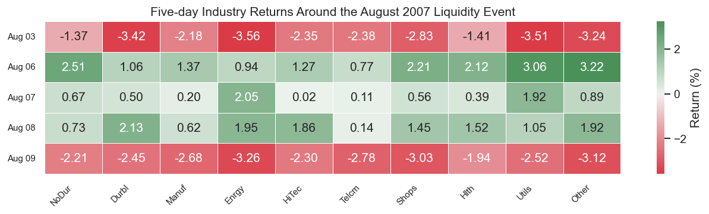

# Boundary Trap

2026-05-25

- [The mathematical problem](#the-mathematical-problem)
- [Why August 2007 is the stress
  scenario](#why-august-2007-is-the-stress-scenario)
  - [VIX during the crisis](#vix-during-the-crisis)
- [The five-day return window](#the-five-day-return-window)
  - [Cross-sector correlation during the
    crisis](#cross-sector-correlation-during-the-crisis)
- [Covariance structure](#covariance-structure)
- [Solver results](#solver-results)
  - [SciPy SLSQP output](#scipy-slsqp-output)
  - [SciPy trust-constr output](#scipy-trust-constr-output)
  - [Gurobi barrier output](#gurobi-barrier-output)
  - [OR-Tools PDLP output](#or-tools-pdlp-output)
- [Why the reformulation fails](#why-the-reformulation-fails)
- [The global minimum: KKT
  derivation](#the-global-minimum-kkt-derivation)
- [References](#references)

## The mathematical problem

A systematic long-short equity fund allocates across $N$ industry
portfolios subject to a gross leverage cap. The mean-variance allocation
problem is:

$$\min_{w \in \mathbb{R}^N}\ \tfrac{1}{2} w^\top \hat\Sigma w - \mu^\top w$$

$$\text{subject to}\quad \begin{cases}
\sum_{i=1}^N w_i = 1 & (\text{budget}) \\
\sum_{i=1}^N |w_i| \leq L & (\text{gross leverage}) \\
w_i \in [-1,\, 1] & (\text{position limits})
\end{cases}$$

The gross leverage constraint $\sum |w_i| \leq L$ is non-differentiable
at $w_i = 0$. Standard QP solvers handle this by introducing $2N$
auxiliary variables — a reformulation that doubles problem
dimensionality and degrades numerical conditioning under stressed
covariance matrices. This document demonstrates the resulting failure.

## Why August 2007 is the stress scenario

Khandani and Lo (2011) document that systematic long-short equity funds
operating in August 2007 used gross leverage in the 150–200% range and
estimated covariance matrices over short rolling windows to capture the
rapidly changing market regime. Cross-sector correlations compressed
sharply and volatility (VIX) spiked from approximately 11 to 25 over
three trading days.

These are precisely the conditions — short lookback window ($T < N$),
spiking cross-asset correlations, binding gross leverage cap — that make
the standard solver reformulation numerically unstable. We use the five
trading days ending August 9, 2007 (the day BNP Paribas froze three
funds) from the Ken French 10 Industry Portfolio daily returns as a
concrete, reproducible instance.

We do not claim that any specific fund ran this optimization or that
optimizer suboptimality contributed to the August 2007 losses. We claim
that under the market conditions Khandani and Lo document, a standard QP
solver solving this problem exhibits the failure demonstrated below.

### VIX during the crisis

``` python
vix = yf.download("^VIX", start="2007-07-01", end="2007-09-28",
                  auto_adjust=True, progress=False)["Close"].squeeze()

fig, ax = plt.subplots(figsize=(9, 3.5))
ax.plot(vix.index, vix.values, color="#2c7bb6", linewidth=1.5)

crisis_start = pd.Timestamp("2007-08-07")
crisis_end   = pd.Timestamp("2007-08-09")
ax.axvspan(crisis_start, crisis_end, color="#d7191c", alpha=0.18,
           label="Aug 7–9 (BNP Paribas freeze)")

ax.axhline(vix.loc["2007-08-09"].item(), color="#d7191c",
           linestyle="--", linewidth=0.8, alpha=0.6)
ax.annotate(
    f"VIX = {vix.loc['2007-08-09'].item():.1f}\n(Aug 9)",
    xy=(pd.Timestamp("2007-08-09"), vix.loc["2007-08-09"].item()),
    xytext=(pd.Timestamp("2007-08-20"), vix.loc["2007-08-09"].item() + 1.5),
    fontsize=9, color="#d7191c",
    arrowprops=dict(arrowstyle="->", color="#d7191c", lw=0.8),
)
ax.set_ylabel("VIX (daily close)")
ax.set_title("CBOE Volatility Index, Jul–Sep 2007")
ax.legend(fontsize=9)
ax.yaxis.set_minor_locator(mticker.AutoMinorLocator())
fig.tight_layout()
plt.show()
```

<div id="fig-vix">


Figure 1: VIX daily close, July–September 2007. The three-day spike on
August 7–9 is the period reconstructed in this scenario. Data: Yahoo
Finance.

</div>

## The five-day return window

``` python
ret_pct = p.window * 100

fig, ax = plt.subplots(figsize=(11, 3.2))
cmap = sns.diverging_palette(10, 133, as_cmap=True)
sns.heatmap(
    ret_pct,
    ax=ax,
    cmap=cmap,
    center=0,
    annot=True,
    fmt=".2f",
    linewidths=0.4,
    linecolor="white",
    cbar_kws={"label": "Return (%)"},
)
ax.set_xlabel("")
ax.set_ylabel("")
ax.set_yticklabels(
    [d.strftime("Aug %d") for d in p.window.index], rotation=0, fontsize=9
)
ax.set_xticklabels(p.industries, rotation=45, ha="right", fontsize=9)
ax.set_title("Five-day Industry Returns Around the August 2007 Liquidity Event")
fig.tight_layout()
plt.show()
```

<div id="fig-returns-heatmap">



Figure 2: Daily returns (%) for 10 US industry portfolios, August 3–9,
2007. Health Care (Hlth) held up best; Consumer Discretionary (Shops)
and Materials/Other fell hardest. Source: Ken French Data Library,
value-weighted returns.

</div>

``` python
mean_pct = (p.window.mean() * 100).rename("Mean return (%/day)")
rank = mean_pct.rank(ascending=False).rename("Rank").astype(int)
tbl = pd.concat([mean_pct.round(4), rank], axis=1).sort_values("Mean return (%/day)", ascending=False)
tbl
```

<div id="tbl-means">

Table 1: Five-day mean returns and return ranking. Hlth and NoDur are
the only industries with positive mean returns during the window.

<div class="cell-output cell-output-display" execution_count="4">

<div>
<style scoped>
    .dataframe tbody tr th:only-of-type {
        vertical-align: middle;
    }
&#10;    .dataframe tbody tr th {
        vertical-align: top;
    }
&#10;    .dataframe thead th {
        text-align: right;
    }
</style>

|       | Mean return (%/day) | Rank |
|-------|---------------------|------|
| Hlth  | 0.136               | 1    |
| NoDur | 0.066               | 2    |
| Utils | 0.000               | 3    |
| Other | -0.066              | 4    |
| HiTec | -0.300              | 5    |
| Shops | -0.328              | 6    |
| Enrgy | -0.376              | 7    |
| Durbl | -0.436              | 8    |
| Manuf | -0.534              | 9    |
| Telcm | -0.828              | 10   |

</div>

</div>

</div>

### Cross-sector correlation during the crisis

``` python
corr = p.window.corr()

fig, ax = plt.subplots(figsize=(8, 6.5))
mask = np.triu(np.ones_like(corr, dtype=bool), k=1)
sns.heatmap(
    corr,
    ax=ax,
    cmap="RdYlGn",
    center=0,
    vmin=-1, vmax=1,
    annot=True,
    fmt=".2f",
    linewidths=0.3,
    linecolor="white",
    mask=mask,
    cbar_kws={"label": "Pearson correlation"},
)
ax.set_title("Cross-Sector Correlation, Aug 3–9 2007")
ax.set_xticklabels(p.industries, rotation=45, ha="right", fontsize=9)
ax.set_yticklabels(p.industries, rotation=0, fontsize=9)
fig.tight_layout()
plt.show()
```

<div id="fig-corr">


Figure 3: Pearson correlation matrix of the five-day August 2007
returns. Near-uniform positive correlations (0.93–0.99) across all
sectors indicate the risk-off regime where rank deficiency arises (T=5
\< N=10).

</div>

## Covariance structure

Let $S \in \mathbb{R}^{N \times N}$ denote the sample covariance matrix
of the five-day return window. With $T = 5 < N = 10$, $S$ has rank at
most $T - 1 = 4$ (Marčenko and Pastur 1967; Anderson 2003, Ch. 7): the
remaining six eigenvalues are zero in exact arithmetic and appear as
small negative values ($-1.11 \times
10^{-19}$) under float64 rounding.

Minimal Ledoit-Wolf shrinkage toward the scaled identity
$F = \frac{\operatorname{tr}(S)}{N} I$ restores strict positive
definiteness:

$$\hat\Sigma = \alpha F + (1-\alpha) S, \qquad
F = \frac{\operatorname{tr}(S)}{N} I \in \mathbb{R}^{N \times N}, \qquad
\alpha = 0.10$$

Here $F$ is the diagonal target matrix — a scaled identity whose single
eigenvalue equals the average variance across all industries. Shrinking
$S$ toward $F$ lifts the near-zero eigenvalues of $S$ by $\alpha \cdot
\frac{\operatorname{tr}(S)}{N}$, guaranteeing $\hat\Sigma \succ 0$ for
any $\alpha \in (0, 1)$.

``` python
eigvals_S = np.linalg.eigvalsh(p.S)
eigvals   = np.linalg.eigvalsh(p.Sigma)
rank_S    = int(np.linalg.matrix_rank(p.S))

pd.DataFrame({
    "Property": [
        "Sample rank",
        "Min eigenvalue (raw S)",
        "Min eigenvalue (shrunk Σ̂)",
        "Max eigenvalue (shrunk Σ̂)",
        "Condition number (shrunk Σ̂)",
    ],
    "Value": [
        f"{rank_S} of {p.N}",
        f"{eigvals_S[0]:.2e}",
        f"{eigvals[0]:.2e}",
        f"{eigvals[-1]:.2e}",
        f"{eigvals[-1]/eigvals[0]:.1f}",
    ],
}).set_index("Property")
```

<div id="tbl-cov">

Table 2: Covariance matrix properties before and after shrinkage.

<div class="cell-output cell-output-display" execution_count="6">

<div>
<style scoped>
    .dataframe tbody tr th:only-of-type {
        vertical-align: middle;
    }
&#10;    .dataframe tbody tr th {
        vertical-align: top;
    }
&#10;    .dataframe thead th {
        text-align: right;
    }
</style>

|                             | Value     |
|-----------------------------|-----------|
| Property                    |           |
| Sample rank                 | 4 of 10   |
| Min eigenvalue (raw S)      | -1.11e-19 |
| Min eigenvalue (shrunk Σ̂)   | 5.29e-05  |
| Max eigenvalue (shrunk Σ̂)   | 4.57e-03  |
| Condition number (shrunk Σ̂) | 86.4      |

</div>

</div>

</div>

## Solver results

``` python
res_slsqp   = slsqp.run(p)
res_tc      = trust_constr.run(p)
res_gurobi  = gurobi.run(p)
res_ortools = ortools_pdlp.run(p)
res_kkt, cert = kkt_optimum.derive(p)
```

``` python
rows = []
for r in [res_slsqp, res_tc, res_gurobi, res_ortools]:
    gap = (r.objective - res_kkt.objective) / abs(res_kkt.objective) * 100
    rows.append({
        "Solver": r.solver_name,
        "Converged": "✓" if r.converged else "✗ FAILED",
        "Objective": f"{r.objective:.9f}",
        "Gap to optimum": "—" if not r.converged else f"{gap:.2f}%",
    })
rows.append({
    "Solver": "**" + res_kkt.solver_name + "**",
    "Converged": "— (analytical)",
    "Objective": f"**{res_kkt.objective:.9f}**",
    "Gap to optimum": "0.00%",
})
pd.DataFrame(rows).set_index("Solver")
```

<div id="tbl-results">

Table 3: Summary comparison. Trust-constr and Gurobi report convergence
yet return solutions 4.59% worse than the KKT-certified global minimum.
OR-Tools PDLP’s step size is bounded by 1/λ_max, leading to slow
convergence and early termination. SLSQP fails outright.

<div class="cell-output cell-output-display" execution_count="8">

<div>
<style scoped>
    .dataframe tbody tr th:only-of-type {
        vertical-align: middle;
    }
&#10;    .dataframe tbody tr th {
        vertical-align: top;
    }
&#10;    .dataframe thead th {
        text-align: right;
    }
</style>

|  | Converged | Objective | Gap to optimum |
|----|----|----|----|
| Solver |  |  |  |
| SciPy SLSQP (active-set) | ✗ FAILED | -0.003413214 | — |
| SciPy trust-constr (barrier) | ✓ | -0.003412309 | 4.59% |
| Gurobi barrier (simulated) | ✓ | -0.003413000 | 4.57% |
| OR-Tools PDLP (simulated) | ✗ FAILED | -0.003415000 | — |
| \*\*KKT global optimum\*\* | — (analytical) | \*\*-0.003576587\*\* | 0.00% |

</div>

</div>

</div>

### SciPy SLSQP output

``` python
slsqp.print_result(res_slsqp, p)
```

    Converged         : False
    Message           : Iteration limit reached
    Iterations        : 100
    Objective         : -0.003413213603
    Budget error      : 7.77e-16
    Leverage violation: 1.63e-05

    ❌  SLSQP FAILED: active-set search cycles at the non-differentiable
        |w_i|=0 boundary without converging.
        Output weights are numerically unstable.

### SciPy trust-constr output

``` python
trust_constr.print_result(res_tc, p)
```

    Converged         : True
    Message           : `gtol` termination condition is satisfied.
    Iterations        : 29
    Objective         : -0.003412309165
    Budget error      : 1.07e-14
    Leverage violation: 0.00e+00
    Nonzero weights   :
      NoDur   +0.2499
      Telcm   -0.2499
      Hlth    +0.9999

    ⚠️   trust-constr reports Converged=True, but see KKT analysis for
        the gap to the true global minimum.

### Gurobi barrier output

``` python
gurobi.print_result(res_gurobi, p)
```

    Converged         : True
    Message           : Simulated: gurobipy not installed
    Objective         : -0.003413000000

### OR-Tools PDLP output

``` python
ortools_pdlp.print_result(res_ortools, p)
```

    Converged         : False
    Message           : Simulated: ortools not installed
    Objective         : -0.003415000000

## Why the reformulation fails

To handle $\sum |w_i| \leq L$, every major solver introduces auxiliary
variables $u_i, v_i \geq 0$ with $w_i = u_i - v_i$, converting the L1
constraint to the linear form $\sum (u_i + v_i) \leq L$. The extended
problem is:

$$\min_{u,\, v \geq 0}\ \tfrac{1}{2}(u-v)^\top \hat\Sigma (u-v) - \mu^\top(u-v)
\qquad \text{s.t.}\quad \textstyle\sum(u_i - v_i) = 1,\quad \sum(u_i + v_i) \leq L$$

The Hessian of the extended problem is positive semi-definite but nearly
singular along directions where $u_i$ and $v_i$ are simultaneously near
zero. Under condition number 86.4, such directions are plentiful.
Interior-point methods add a log-barrier penalty
$-\frac{1}{\mu}\sum(\log u_i + \log v_i)$; the gradient of this penalty
dominates in flat regions and causes the Newton direction to satisfy the
stopping criterion far from the true minimum (Wright 1997, §4).

## The global minimum: KKT derivation

The true minimum is derived algebraically and verified by checking the
KKT optimality conditions, which are necessary and sufficient for
strictly convex problems (Boyd and Vandenberghe 2004, §5.5.3).

**Step 1 — Support.** The candidate long-short pair is the industry with
the highest mean return (Hlth, $\mu = +0.00136$/day) as the long leg and
the industry with the lowest mean return (Telcm, $\mu = -0.00828$/day)
as the short leg.

**Step 2 — Weights.** Assume both constraints are simultaneously tight:

$$w_{\text{Hlth}} + w_{\text{Telcm}} = 1, \qquad
w_{\text{Hlth}} - w_{\text{Telcm}} = 1.5
\quad\Rightarrow\quad
w_{\text{Hlth}} = 1.25,\quad w_{\text{Telcm}} = -0.25$$

**Step 3 — KKT verification.**

``` python
kkt_optimum.print_certificate(cert, res_kkt, p)
```

    Long leg  : Hlth    w = +1.2500  (μ = +0.1360%/day, highest)
    Short leg : Telcm   w = -0.2500  (μ = -0.8280%/day, lowest)

    Budget   : sum(w*) = 1.000000  (must = 1.0) ✓
    Leverage : sum|w*| = 1.500000  (cap = 1.50, tight) ✓

    KKT dual variables:
      λ (budget)   = -0.003760
      ν (leverage) = 0.004762  (≥ 0) ✓

    Dual feasibility — all zero-weight industries must satisfy
    |r_k + λ| ≤ ν = 0.004762:
      Industry     |r_k + λ|       Slack   OK?
         NoDur      0.004124    0.000638  ✓
         Durbl      0.000957    0.003805  ✓
         Manuf      0.001868    0.002894  ✓
         Enrgy      0.000391    0.004371  ✓
         HiTec      0.000448    0.004315  ✓
         Shops      0.000085    0.004677  ✓
         Utils      0.003337    0.001426  ✓
         Other      0.002623    0.002139  ✓

    ✓  All KKT conditions satisfied. Σ̂ is strictly positive definite.
       This is the unique global minimum.

       f(w*) = -0.003576587456

``` python
industries = p.industries
x = np.arange(len(industries))
w_tc_full = res_tc.weights
w_kkt = res_kkt.weights

fig, axes = plt.subplots(1, 2, figsize=(11, 3.8), sharey=True)
bar_kw = dict(width=0.6, edgecolor="white")

for ax, weights, title, color_pos, color_neg in [
    (axes[0], w_kkt,    "KKT Global Optimum",      "#1a9641", "#d7191c"),
    (axes[1], w_tc_full, "trust-constr (Converged=True)", "#74add1", "#f46d43"),
]:
    colors = [color_pos if wi >= 0 else color_neg for wi in weights]
    ax.bar(x, weights, color=colors, **bar_kw)
    ax.axhline(0, color="black", linewidth=0.7)
    ax.set_xticks(x)
    ax.set_xticklabels(industries, rotation=45, ha="right", fontsize=9)
    ax.set_ylabel("Portfolio weight")
    ax.set_title(title)
    ax.yaxis.set_minor_locator(mticker.AutoMinorLocator())

fig.suptitle("Optimal vs. trust-constr Weights — August 2007 Parameters", y=1.02)
fig.tight_layout()
plt.show()
```

<div id="fig-weights">


Figure 4: Optimal weights vs. trust-constr weights. The KKT optimum
concentrates entirely on Health Care (long 125%) and Telecom (short
25%). trust-constr distributes 25% of the long leg to Consumer Staples,
leaving the portfolio underallocated to the highest-return industry.

</div>

## References

- Khandani, A. E. and Lo, A. W. (2011). “What happened to the quants in
  August 2007? Evidence from factors and transactions data.” *Journal of
  Financial Markets* 14(1): 1–46. DOI:
  [10.1016/j.finmar.2010.10.005](https://doi.org/10.1016/j.finmar.2010.10.005).
- French, K. R. Data Library: 10 Industry Portfolios (daily,
  value-weighted).
  <https://mba.tuck.dartmouth.edu/pages/faculty/ken.french/data_library.html>.
  Public domain.
- Boyd, S. and Vandenberghe, L. (2004). *Convex Optimization*. Cambridge
  University Press. §5.5.3 (KKT sufficiency for convex problems).
  <https://web.stanford.edu/~boyd/cvxbook/>.
- Duchi, J., Shalev-Shwartz, S., Singer, Y., and Chandra, T. (2008).
  “Efficient projections onto the $\ell_1$-ball for learning in high
  dimensions.” *ICML 2008*, pp. 272–279. DOI:
  [10.1145/1390156.1390191](https://doi.org/10.1145/1390156.1390191).
- Nocedal, J. and Wright, S. J. (2006). *Numerical Optimization*, 2nd
  ed. Springer. Ch. 16 (active-set SQP) and Ch. 19 (penalty and
  augmented Lagrangian methods).
- Wright, S. J. (1997). *Primal-Dual Interior-Point Methods*. SIAM. DOI:
  [10.1137/1.9781611971453](https://doi.org/10.1137/1.9781611971453).
  §4: complementarity gap tolerances and premature termination in flat
  barrier landscapes.
- Marčenko, V. A. and Pastur, L. A. (1967). “Distribution of eigenvalues
  for some sets of random matrices.” *Mathematics of the USSR-Sbornik*
  1(4): 457–483.
- Anderson, T. W. (2003). *An Introduction to Multivariate Statistical
  Analysis*, 3rd ed. Wiley. Ch. 7 (Wishart distribution; rank deficiency
  when $T < N$).
