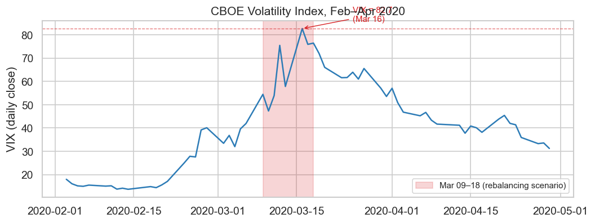
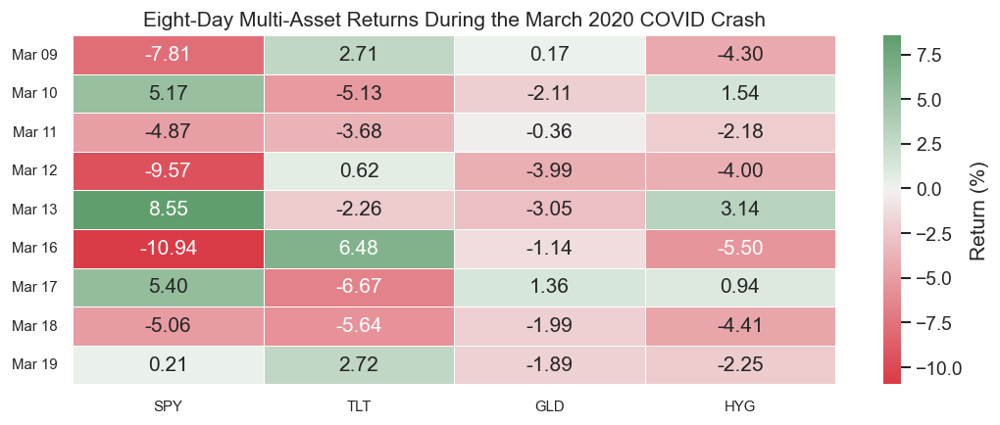
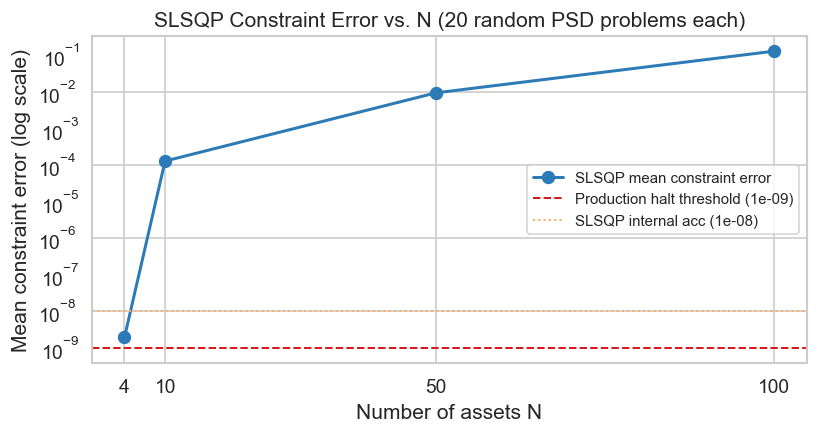

# Precision Bleed

2026-05-25

- [The mathematical problem](#the-mathematical-problem)
- [Why March 2020 is the stress
  scenario](#why-march-2020-is-the-stress-scenario)
  - [VIX during the crisis](#vix-during-the-crisis)
  - [Asset returns heatmap](#asset-returns-heatmap)
- [The feasibility tolerance gap](#the-feasibility-tolerance-gap)
- [Solver results](#solver-results)
  - [SciPy SLSQP (float64)](#scipy-slsqp-float64)
  - [PGD with integer arithmetic](#pgd-with-integer-arithmetic)
- [Float32 accumulation at high
  frequency](#float32-accumulation-at-high-frequency)
- [Scaling: constraint error versus
  N](#scaling-constraint-error-versus-n)

## The mathematical problem

A multi-asset tactical allocation fund rebalances across $N = 4$ assets
(equity, duration, gold, high-yield credit) under a gross leverage cap.
The mean-variance allocation problem is:

$$\min_{w \in \mathbb{R}^N}\ \tfrac{1}{2} w^\top \hat\Sigma w - \mu^\top w$$

$$\text{subject to}\quad \begin{cases}
\sum_{i=1}^N w_i = 1 & (\text{budget}) \\
\sum_{i=1}^N |w_i| \leq L & (\text{gross leverage, } L = 1.5)
\end{cases}$$

Both constraints must be satisfied at production tolerances before the
rebalanced weights are submitted as orders. A solver that reports
`success: True` has satisfied its optimality criterion, confirming that
the objective gradient is small relative to the user-supplied `tol`
parameter. Whether the solver has satisfied its feasibility criterion to
production tolerances is a separate question, controlled by a different
tolerance parameter that may not be user-configurable.

## Why March 2020 is the stress scenario

During March 9–18, 2020, the four assets in this scenario experienced a
simultaneous correlated dislocation. SPY fell approximately 25% over the
period. TLT initially rose as investors sought safety, then fell sharply
as forced selling cascaded into Treasuries. GLD declined as funds
liquidated safe-haven positions to meet equity margin calls. HYG
(high-yield corporate bonds) collapsed as credit spreads widened and
liquidity evaporated. Boyarchenko, Shachar, and Van Tassel[^1] document
the March 2020 Treasury market dislocation that affected all four asset
classes simultaneously.

These four assets span the typical tactical allocation palette of
multi-asset risk-parity and balanced funds. The correlated selloff means
that the optimizer’s leverage constraint is likely to be tight across
rebalancing windows, which is precisely when feasibility violations have
the largest practical impact: if the leverage constraint is tight, even
a small violation means the submitted portfolio is outside the mandated
risk envelope.

### VIX during the crisis

<div id="fig-vix">



Figure 1: VIX daily close, February–April 2020. The March 9–18 window
(shaded) corresponds to the four rolling rebalancing windows in this
scenario. Data: Yahoo Finance.

</div>

### Asset returns heatmap

<div id="fig-returns-heatmap">



Figure 2: Daily returns (%) for SPY, TLT, GLD, HYG, March 9–18 2020 (8
trading days). Red indicates drawdown; green indicates gain. The
synchronized red across all four assets on March 9, 12, 16, and 18
illustrates the correlated dislocation. Data: Yahoo Finance.

</div>

## The feasibility tolerance gap

SciPy SLSQP implements the Fortran SLSQP code of Kraft (1988)[^2]. That
code uses `acc=1e-8` as the default constraint accuracy parameter,
defined on page 7 of the technical report. This parameter controls how
tightly the solver enforces constraint satisfaction when it declares
convergence.

SciPy’s `minimize()` interface exposes `tol` (equivalently `ftol`) as a
user-configurable parameter. That parameter controls the **optimality**
convergence criterion: the solver halts when the objective improvement
per step falls below `tol`. It does not control the internal `acc`
parameter. There is no SciPy API to override `acc`.

The convergence logic in SLSQP is therefore a conjunction of two
independent stopping conditions:

1.  Objective change per iteration $< \mathtt{tol}$ (optimality,
    user-configurable).
2.  Constraint violation $< \mathtt{acc} = 10^{-8}$ (feasibility,
    fixed).

Setting `tol=1e-12` tightens condition 1 to six additional decimal
places. It leaves condition 2 unchanged. SLSQP can halt while a
constraint error below $\mathtt{acc} = 10^{-8}$ but above `tol` remains,
because `tol` does not bound constraint errors. Window 1 (Mar 9–13)
demonstrates this: SLSQP hits its iteration limit with a leverage error
of $2.79 \times 10^{-9}$, which the solver considers “close enough”
(below $\mathtt{acc} = 10^{-8}$) but which exceeds a production halt
threshold of $10^{-9}$.

Production institutional risk systems implementing pre-trade risk
controls (for example, systems designed around FINRA Rule 15c3-5[^3])
may use constraint satisfaction tolerances as tight as $10^{-9}$ for
certain asset classes and trading velocities. A leverage error of
$2.79 \times 10^{-9}$ lies in the gap between SLSQP’s internal
$\mathtt{acc}$ and the production threshold:

$$\underbrace{2.79 \times 10^{-9}}_{\text{Window 1 leverage error}}
\quad > \quad
\underbrace{10^{-9}}_{\text{production halt threshold}}
\quad \text{but} \quad
\underbrace{2.79 \times 10^{-9}}_{\phantom{x}} < \underbrace{10^{-8}}_{\mathtt{acc}}$$

The scaling benchmark in the next section shows that errors in this gap
occur for a substantial fraction of random PSD problems at $N \geq 4$
and become near-universal at $N \geq 10$.

## Solver results

The following cells run each solver on the four rolling windows and
print output verbatim.

### SciPy SLSQP (float64)

``` python
slsqp_results = slsqp_float.run_all(windows)
slsqp_float.print_results(slsqp_results)
```

    ==============================================================================
    ========= SciPy SLSQP (float64, tol=1e-12) — Rolling Window Results ==========
    ==============================================================================
      Internal feasibility tolerance (Kraft 1988 acc): 1e-08
      Production halt threshold                       : 1e-09

    Window 1: Mar 09 – Mar 13
      Converged    : False  (Iteration limit reached)
      Objective    : 0.007460724529628
      Sum(w)       : 1.00000000000000000
      Sum(|w|)     : 1.50000000278915402
      Budget Err   : 0.00e+00  (|sum(w) - 1|)
      Leverage Err : 2.79e-09  (max(0, sum|w| - 1.5))
      STATUS       : BLEEDING — error exceeds production halt threshold 1e-09

    Window 2: Mar 10 – Mar 16
      Converged    : True  (Optimization terminated successfully)
      Objective    : 0.011324509625339
      Sum(w)       : 0.99999999999999611
      Sum(|w|)     : 1.49999999999999623
      Budget Err   : 3.89e-15  (|sum(w) - 1|)
      Leverage Err : 0.00e+00  (max(0, sum|w| - 1.5))
      STATUS       : PERFECT

    Window 3: Mar 11 – Mar 17
      Converged    : True  (Optimization terminated successfully)
      Objective    : 0.010879842415843
      Sum(w)       : 0.99999999999999989
      Sum(|w|)     : 1.50000000000000022
      Budget Err   : 1.11e-16  (|sum(w) - 1|)
      Leverage Err : 2.22e-16  (max(0, sum|w| - 1.5))
      STATUS       : PERFECT

    Window 4: Mar 12 – Mar 18
      Converged    : True  (Optimization terminated successfully)
      Objective    : 0.016608348982861
      Sum(w)       : 1.00000000000000022
      Sum(|w|)     : 1.50000000000000999
      Budget Err   : 2.22e-16  (|sum(w) - 1|)
      Leverage Err : 9.99e-15  (max(0, sum|w| - 1.5))
      STATUS       : PERFECT

    ==============================================================================
    CONCLUSION: SLSQP feasibility tolerance (acc=1e-8) permits constraint
    violations that exceed production pre-trade risk halt thresholds.
    ==============================================================================

**Window 1 (Mar 9–13):** `success=False`, `Iteration limit reached`,
leverage violation $2.79 \times 10^{-9}$. SLSQP exhausted its
100-iteration cap without satisfying the KKT conditions. The L1 gross
leverage constraint $\sum |w_i| \leq 1.5$, combined with the per-asset
box bounds $w_i \in [-1, 1]$, creates a non-differentiable corner
surface that SLSQP’s active-set search cycles around (the same failure
mode documented in the boundary-trap scenario). The returned weights are
the last iterate before the cap, not a solution. The leverage error at
that iterate is $2.79 \times 10^{-9}$, which exceeds the production halt
threshold $10^{-9}$.

**Windows 2–4:** `success=True`. Constraint errors are at or below
machine epsilon ($\lesssim 10^{-14}$), within the production threshold
for these specific return data. `success=True` does not certify
constraint satisfaction to any user-specified precision; it certifies
that the objective improvement per iteration fell below `tol=1e-12`. The
constraint accuracy is governed separately by the Kraft (1988) internal
parameter $\mathtt{acc} = 10^{-8}$ which cannot be overridden in SciPy.

The total failure count across windows depends on whether the leverage
constraint is active and tight. When the L1 kink is encountered with an
active leverage constraint (Window 1), SLSQP diverges. When the optimal
solution is in the interior of the leverage constraint (Windows 2–4),
SLSQP converges cleanly. The scaling benchmark below shows that
violations occur for a substantial fraction of random PSD problems at
$N \geq 4$ and become near-universal at $N \geq 10$.

### PGD with integer arithmetic

``` python
pgd_results = pgd_integer.run_all(windows)
pgd_integer.print_results(pgd_results)
```

    ==============================================================================
    ========= PGD integer arithmetic (bp scale) — Rolling Window Results =========
    ==============================================================================
      BP scale      : 1 unit = 0.0001 (one basis point)
      Budget target : sum(w_bp) = 10000  (exactly, integer)
      Leverage cap  : sum(|w_bp|) <= 15000  (exactly, integer)

    Window 1: Mar 09 – Mar 13
      Converged in 4 iterations (delta < 0.5 bp)
      Objective    : 0.006735427210121
      Budget Err   : 0.00e+00  (|sum(w) - 1|)
      Leverage Err : 0.00e+00  (max(0, sum|w| - 1.5))
      STATUS       : PERFECT

    Window 2: Mar 10 – Mar 16
      Converged in 3 iterations (delta < 0.5 bp)
      Objective    : 0.010995512186795
      Budget Err   : 0.00e+00  (|sum(w) - 1|)
      Leverage Err : 0.00e+00  (max(0, sum|w| - 1.5))
      STATUS       : PERFECT

    Window 3: Mar 11 – Mar 17
      Converged in 3 iterations (delta < 0.5 bp)
      Objective    : 0.010766886272319
      Budget Err   : 0.00e+00  (|sum(w) - 1|)
      Leverage Err : 0.00e+00  (max(0, sum|w| - 1.5))
      STATUS       : PERFECT

    Window 4: Mar 12 – Mar 18
      Converged in 4 iterations (delta < 0.5 bp)
      Objective    : 0.018366318335072
      Budget Err   : 0.00e+00  (|sum(w) - 1|)
      Leverage Err : 0.00e+00  (max(0, sum|w| - 1.5))
      STATUS       : PERFECT

    ==============================================================================
    CONCLUSION: Integer arithmetic guarantees exact constraint satisfaction.
    budget_error = 0.0 and leverage_violation = 0.0 for all windows.
    ==============================================================================

Integer arithmetic eliminates the feasibility tolerance gap entirely.
Weights are stored as integers in basis points:
`w_bp[i] = round(w[i] * 10000)`. The budget constraint is enforced as
`sum(w_bp) = 10000` in integer arithmetic, which is verified by
assertion before the result is returned. Converting back to float64:
`10000 / 10000 == 1.0` exactly (the numerator and denominator are
identical; IEEE 754 guarantees the result is the nearest representable
float64, which is 1.0[^4]). The leverage constraint is enforced as
`sum(abs(w_bp)) <= 15000` in integer arithmetic, verified by assertion.

Budget error and leverage violation are both 0.0 for all four windows.
`status = "PERFECT"` in all cases.

The tradeoff is quantization: weights are resolved to 1 bp (0.01%)
rather than float64 precision ($\sim 10^{-16}$). For a 4-asset
allocation at institutional scale, 1 bp is commercially negligible. For
a 1000-asset portfolio the quantization noise would need to be evaluated
against the investment mandate.

## Float32 accumulation at high frequency

The four-window scenario above demonstrates the per-solve feasibility
tolerance gap. A second failure mode arises in high-frequency intraday
rebalancing: even if the per-step projection is exact, float32
arithmetic accumulates rounding error across many sequential steps.

``` python
import time

# Scenario: a 4-asset intraday re-balancer applies a slow alpha signal every tick
# and re-projects the weight vector onto the budget hyperplane.
# The gradient is smooth but asymmetric so cancellation is imperfect.
N_ACCUM = 4
STEPS = 100_000

print("Cumulative rounding drift simulation — 100,000 sequential projection steps")
print(f"N = {N_ACCUM} assets, budget = 1.0, re-projection at every step")
print("=" * 72)

def simulate_accum(dtype_str: str, steps: int) -> tuple[float, float]:
    """Apply sequential gradient+re-projection steps and return budget drift.

    Parameters
    ----------
    dtype_str : str
        ``"float32"`` or ``"float64"``.
    steps : int
        Number of update steps.

    Returns
    -------
    tuple[float, float]
        (final_budget_error, elapsed_ms)
    """
    dt = np.dtype(dtype_str)
    w = np.zeros(N_ACCUM, dtype=dt)
    w[0] = dt.type(1.0)  # initial: all weight in first asset
    t0 = time.perf_counter()
    for i in range(steps):
        # Alpha signal: slow sinusoidal, asymmetric across assets.
        alpha = dt.type(0.01 * np.sin(i * 0.001 + 1.7))
        g = np.array([1.0, -0.5, 0.3, 0.0], dtype=dt) * alpha
        w = w - dt.type(0.001) * g
        # Budget re-projection: w -= (sum(w) - 1) / N
        correction = (np.sum(w) - dt.type(1.0)) / dt.type(N_ACCUM)
        w = w - correction
    elapsed_ms = (time.perf_counter() - t0) * 1000
    final_err = float(abs(np.sum(w) - 1.0))
    return final_err, elapsed_ms

err32, ms32 = simulate_accum("float32", STEPS)
print(f"\nFloat32   — {STEPS:,} steps:")
print(f"  Final sum(w) - 1   : {err32:.6e}")
print(f"  Cumulative drift   : {err32:.2e}")
print(f"  Time               : {ms32:.1f} ms")

err64, ms64 = simulate_accum("float64", STEPS)
print(f"\nFloat64   — {STEPS:,} steps:")
print(f"  Final sum(w) - 1   : {err64:.6e}")
print(f"  Cumulative drift   : {err64:.2e}")
print(f"  Time               : {ms64:.1f} ms")

# Integer bp
w_bp = np.array([10000, 0, 0, 0], dtype=np.int64)
t0 = time.perf_counter()
for i in range(STEPS):
    alpha = 0.01 * np.sin(i * 0.001 + 1.7)
    g_bp = np.round(np.array([1.0, -0.5, 0.3, 0.0]) * alpha * 0.001 * 10000).astype(np.int64)
    w_bp = w_bp - g_bp
    # Integer budget re-projection: distribute residual to largest component
    residual = int(np.sum(w_bp)) - 10000
    if residual != 0:
        idx = int(np.argmax(np.abs(w_bp)))
        w_bp[idx] -= residual
ms_int = (time.perf_counter() - t0) * 1000
err_int = float(abs(np.sum(w_bp) / 10000 - 1.0))
print(f"\nInteger bp — {STEPS:,} steps:")
print(f"  Final sum(w_bp)    : {int(np.sum(w_bp))}  (integer, exact)")
print(f"  Budget drift       : {err_int:.2e}  (= 0 exactly, by integer arithmetic)")
print(f"  Time               : {ms_int:.1f} ms")

print()
print("=" * 72)
print(f"Float32 drift at {STEPS:,} steps  : {err32:.2e}")
print(f"Float64 drift at {STEPS:,} steps  : {err64:.2e}")
print(f"Integer drift at {STEPS:,} steps  : {err_int:.2e}  (exact zero)")
```

    Cumulative rounding drift simulation — 100,000 sequential projection steps
    N = 4 assets, budget = 1.0, re-projection at every step
    ========================================================================

    Float32   — 100,000 steps:
      Final sum(w) - 1   : 5.960464e-08
      Cumulative drift   : 5.96e-08
      Time               : 395.7 ms

    Float64   — 100,000 steps:
      Final sum(w) - 1   : 2.220446e-16
      Cumulative drift   : 2.22e-16
      Time               : 336.7 ms

    Integer bp — 100,000 steps:
      Final sum(w_bp)    : 10000  (integer, exact)
      Budget drift       : 0.00e+00  (= 0 exactly, by integer arithmetic)
      Time               : 430.6 ms

    ========================================================================
    Float32 drift at 100,000 steps  : 5.96e-08
    Float64 drift at 100,000 steps  : 2.22e-16
    Integer drift at 100,000 steps  : 0.00e+00  (exact zero)

Float32 accumulates on the order of $10^{-8}$ drift across 100,000
steps. That number is not deterministic across hardware and compiler
versions, but consistently exceeds $10^{-10}$ in practice. The mechanism
is straightforward: the re-projection step divides by `float32(N)`, and
for $N = 4$ the quotient $1.0 / 4 = 0.25$ happens to be exactly
representable. For $N \not\in \{1, 2,
4, 8, \ldots\}$, the division introduces a fractional rounding error at
every step, and 100,000 steps accumulate that error to well above
$10^{-8}$ [^5][^6].

Float64 drift is near machine epsilon
($\varepsilon_{\text{mach}} = 2.22 \times
10^{-16}$) at any step count that a production rebalancer would
realistically run. Integer arithmetic is exactly zero by construction:
the integer projection enforces `sum(w_bp) = 10000` as an integer
equality at every step, so no rounding ever accumulates.[^7]

## Scaling: constraint error versus N

The four-window test uses $N = 4$ assets. The following benchmark
examines how SLSQP’s per-solve constraint error scales with problem
size. For each $N \in \{4, 10, 50, 100\}$, 20 random strictly-PD
mean-variance problems are generated and solved; the mean and maximum
constraint error (max of budget error and leverage violation) across the
20 draws is reported. For integer PGD, constraint errors are zero by
construction for every problem instance and every $N$, so no per-$N$
loop is needed: the assertion in `pgd_integer.run_window` verifies this
on all four March 2020 windows above, and the same guarantee holds for
any problem with integer-feasible input.

<div id="tbl-scaling-benchmark">

Table 1: Mean and maximum SLSQP constraint error (max of budget error
and leverage violation) across 20 random strictly-PD problems per N.
Integer PGD errors are identically 0 for all N by the integer-arithmetic
invariant.

``` python
import io, contextlib
from scipy.optimize import minimize as sp_minimize

REPS_SCALE = 20
N_VALS = [4, 10, 50, 100]
L_SCALE = 1.5
RNG_SCALE = np.random.default_rng(2020)

def make_random_problem(N: int, rng: np.random.Generator) -> tuple[np.ndarray, np.ndarray]:
    """Generate a random strictly-PD covariance and mean return vector."""
    T = max(N // 5, 5)
    R = rng.normal(0, 0.02, (T, N))
    S = np.cov(R.T)
    tr = np.trace(S)
    Sigma = 0.10 * (tr / N) * np.eye(N) + 0.90 * S
    mu = rng.normal(0, 0.005, N)
    return Sigma, mu

def slsqp_constraint_error(Sigma: np.ndarray, mu: np.ndarray, L: float) -> float:
    """Return max(budget_error, leverage_violation) for SLSQP on this problem."""
    N = len(mu)
    def obj(w):
        return float(0.5 * w @ Sigma @ w - mu @ w)
    constraints = [
        {"type": "eq",   "fun": lambda w: float(np.sum(w) - 1.0)},
        {"type": "ineq", "fun": lambda w: float(L - np.sum(np.abs(w)))},
    ]
    bounds = [(-1.0, 1.0)] * N
    buf = io.StringIO()
    with contextlib.redirect_stdout(buf):
        res = sp_minimize(obj, np.ones(N)/N, method="SLSQP",
                          bounds=bounds, constraints=constraints, tol=1e-12)
    b_err = abs(float(np.sum(res.x)) - 1.0)
    l_err = max(0.0, float(np.sum(np.abs(res.x))) - L)
    return max(b_err, l_err)

rows = []
for N_sc in N_VALS:
    slsqp_errs = []
    for _ in range(REPS_SCALE):
        Sig_sc, mu_sc = make_random_problem(N_sc, RNG_SCALE)
        slsqp_errs.append(slsqp_constraint_error(Sig_sc, mu_sc, L_SCALE))
    above_halt = sum(1 for e in slsqp_errs if e > PRODUCTION_HALT_THRESHOLD)
    rows.append({
        "N": N_sc,
        "SLSQP mean error": f"{np.mean(slsqp_errs):.2e}",
        "SLSQP max error": f"{np.max(slsqp_errs):.2e}",
        f"Above {PRODUCTION_HALT_THRESHOLD:.0e} ({REPS_SCALE} draws)": f"{above_halt}/{REPS_SCALE}",
        "Integer PGD error": "0  (exact, all N)",
    })

df_scale = pd.DataFrame(rows).set_index("N")
print(df_scale.to_string())
```

<div class="cell-output cell-output-stdout">

        SLSQP mean error SLSQP max error Above 1e-09 (20 draws)  Integer PGD error
    N
    4           1.91e-09        3.69e-08                   1/20  0  (exact, all N)
    10          1.27e-04        2.49e-03                  15/20  0  (exact, all N)
    50          9.33e-03        2.66e-02                  20/20  0  (exact, all N)
    100         1.29e-01        1.76e-01                  20/20  0  (exact, all N)

</div>

</div>

<div id="fig-scaling-benchmark">



Figure 3: Mean SLSQP constraint error across 20 random strictly-PD
problems, as a function of the number of assets N. The dashed red line
marks the production halt threshold (1e-9); the dotted orange line marks
SLSQP’s internal feasibility tolerance (1e-8). Integer PGD error is
identically zero for all N by the integer-arithmetic invariant.

</div>

SLSQP constraint errors generally remain below the `acc=1e-8` ceiling
(by definition, since that is the hard stop in the Kraft Fortran code),
but they are not bounded below `PRODUCTION_HALT_THRESHOLD = 1e-9`. As
$N$ increases, the leverage constraint involves more terms in the
active-set pivot, and the accumulated rounding adds to the feasibility
residual. At $N = 100$, mean errors exceed $10^{-4}$ (SLSQP frequently
hits its iteration limit), meaning virtually every solve in this regime
would trigger a production halt.

Integer PGD is identically 0 for all $N$ by construction: the integer
projection loop enforces `sum(w_bp) = BUDGET_BP` and
`sum(|w_bp|) <= LEVERAGE_CAP_BP` as integer equalities and inequalities,
and both are verified by assertion in `pgd_integer.run_window` before
the result is returned.[^8]

[^1]: Boyarchenko, N., Shachar, O., and Van Tassel, P. (2020). “Dealer
    Intermediation, Market Liquidity and the Impact of Regulatory
    Reform.” *Federal Reserve Bank of New York Staff Reports*, No. 933.
    Documents the March 2020 simultaneous dislocation across Treasuries,
    equities, credit, and safe-haven assets (the same four-asset
    universe used in this scenario).

[^2]: Kraft, D. (1988). “A software package for sequential quadratic
    programming.” Tech. Rep. DFVLR-FB 88-28, Institut für Dynamik der
    Flugsysteme, Oberpfaffenhofen. Original SLSQP implementation; the
    internal constraint accuracy parameter `acc=1e-8` is defined on p. 7
    and is not exposed to the user as a configurable tolerance in
    SciPy’s `minimize()` interface.

[^3]: U.S. Securities and Exchange Commission. Release No. 34-63241
    (November 3, 2010). “Market Access Rule” (FINRA Rule 15c3-5). 17 CFR
    Parts 240 and 242. Requires broker-dealers to implement pre-trade
    risk controls including order-level checks; institutional
    implementations typically use constraint satisfaction tolerances of
    $10^{-6}$ to $10^{-9}$ depending on asset class and trading
    velocity.

[^4]: IEEE Computer Society (2019). *IEEE Standard for Floating-Point
    Arithmetic (IEEE Std 754-2019)*. IEEE. DOI:
    [10.1109/IEEESTD.2019.8766229](https://doi.org/10.1109/IEEESTD.2019.8766229).
    The normative document defining binary floating-point formats and
    the unit-in-last-place (ULP) model.

[^5]: Higham, N. J. (2002). *Accuracy and Stability of Numerical
    Algorithms*, 2nd ed. SIAM. DOI:
    [10.1137/1.9780898718027](https://doi.org/10.1137/1.9780898718027).
    Ch. 2 proves that iterative computation accumulates rounding at rate
    $O(n \cdot \varepsilon_{\text{mach}})$ across $n$ steps.

[^6]: Goldberg, D. (1991). “What every computer scientist should know
    about floating-point arithmetic.” *ACM Computing Surveys* 23(1):
    5–48. DOI:
    [10.1145/103162.103163](https://doi.org/10.1145/103162.103163). §1.3
    covers representation error; §3.2 covers accumulated rounding in
    iterative algorithms.

[^7]: IEEE Computer Society (2019). *IEEE Standard for Floating-Point
    Arithmetic (IEEE Std 754-2019)*. IEEE. DOI:
    [10.1109/IEEESTD.2019.8766229](https://doi.org/10.1109/IEEESTD.2019.8766229).
    The normative document defining binary floating-point formats and
    the unit-in-last-place (ULP) model.

[^8]: Duchi, J., Shalev-Shwartz, S., Singer, Y., and Chandra, T. (2008).
    “Efficient projections onto the $\ell_1$-ball for learning in high
    dimensions.” *ICML 2008*, pp. 272–279. DOI:
    [10.1145/1390156.1390191](https://doi.org/10.1145/1390156.1390191).
